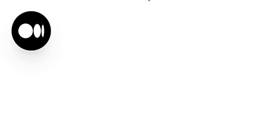

This is a repository for sharing my Vue components.
Built with Vue 3, Tailwindcss, Google fonts.

## Rounded image with a popup

### Demonstration



### Usage


```html
<!-- In index.html -->
<head>
    ...
    <link rel="preconnect" href="https://fonts.googleapis.com">
    <link rel="preconnect" href="https://fonts.gstatic.com" crossorigin>
    <link href="https://fonts.googleapis.com/css2?family=DM+Mono:wght@300&display=swap" rel="stylesheet">
    ...
</head>
```

```html
<!-- In a view/component -->
<template>
    <RoundedImgWithPopup
        mediaLogoSrc="https://play-lh.googleusercontent.com/hB9t3Z-mi284_49HA3nAuhO-W5Cyhje7r2P9McdgORoVCd-0SV54c12NMQWLHnqALw"
        mediaLink="https://medium.com/@networksecurity"
        mediaDescription="This is my Medium.com blog. Here I occasionally write stuff regarding my infosec experience." />
</template>

<script lang="ts">
import { defineComponent } from 'vue';
import RoundedImgWithPopup from '@/components/RoundedImgWithPopup.vue';

export default defineComponent({
    name: 'RoundedImgWithPopupView',
    components: {
        RoundedImgWithPopup,
    },
});
</script>
```

#### [Source code](src/components/RoundedImgWithPopup.vue)
