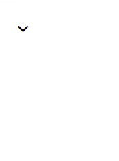

This is a repository for sharing my Vue components.
Built with Vue 3, Tailwindcss, Google fonts.

## • Rounded image with a popup

### Demonstration


### Usage


```html
<!-- In index.html -->
<head>
    ...
    <link rel="preconnect" href="https://fonts.googleapis.com">
    <link rel="preconnect" href="https://fonts.gstatic.com" crossorigin>
    <link href="https://fonts.googleapis.com/css2?family=DM+Mono:wght@300&display=swap" rel="stylesheet">
    ...
</head>
```

```html
<!-- In a view/component -->
<template>
    <RoundedImgWithPopup
        mediaLogoSrc="https://play-lh.googleusercontent.com/hB9t3Z-mi284_49HA3nAuhO-W5Cyhje7r2P9McdgORoVCd-0SV54c12NMQWLHnqALw"
        mediaLink="https://medium.com/@networksecurity"
        mediaDescription="This is my Medium.com blog. Here I occasionally write stuff regarding my infosec experience." />
</template>

<script lang="ts">
import { defineComponent } from 'vue';
import RoundedImgWithPopup from '@/components/RoundedImgWithPopup.vue';

export default defineComponent({
    name: 'RoundedImgWithPopupView',
    components: {
        RoundedImgWithPopup,
    },
});
</script>
```

#### [Source code](src/components/RoundedImgWithPopup.vue)

## • Circular layout

### Demonstration


### Usage

```html
<!-- In a view/component -->
<template>
    <div class="h-screen flex justify-center items-center">
        <CircularLayout radiusPx="160" midElementAngle="-45" order="clockwise" angularSpacing="20">
            <template v-slot:centralElement>
                <div class="w-10 h-10 rounded-full bg-slate-500"></div>
            </template>
            <template v-slot:surroundingElements>
                <div class="w-10 h-10 rounded-full bg-red-400"></div>
                <div class="w-10 h-10 rounded-full bg-orange-500"></div>
                <div class="w-10 h-10 rounded-full bg-amber-300"></div>
                <div class="w-10 h-10 rounded-full bg-lime-400"></div>
                <div class="w-10 h-10 rounded-full bg-emerald-300"></div>
                <div class="w-10 h-10 rounded-full bg-teal-400"></div>
                <div class="w-10 h-10 rounded-full bg-cyan-400"></div>
            </template>
        </CircularLayout>
    </div>
</template>

<script lang="ts">
import { defineComponent } from 'vue';
import CircularLayout from '@/components/CircularLayout.vue';

export default defineComponent({
    name: 'CircularLayoutView',
    components: {
        CircularLayout,
    },
});
</script>
```

#### [Source code](src/components/CircularLayout.vue)

## • Dropdown menu

### Demonstration



### Usage

```html
<!-- In index.html -->
<head>
    ...
    <script src="https://kit.fontawesome.com/<your_kit_id>.js" crossorigin="anonymous"></script>
    ...
</head>
```

```html
<!-- In a view/component -->
<template>
    <ArrowDropdown class="absolute top-15 left-15">
        <li>
            <a href="#" class="p-1 hover:bg-slate-200 font-bold rounded-md cursor-pointer">Create</a>
        </li>
        <li>
            <a href="#" class="p-1 hover:bg-slate-200 font-bold rounded-md cursor-pointer">About</a>
        </li>
        <li>
            <a href="#" class="p-1 hover:bg-slate-200 font-bold rounded-md cursor-pointer">Author</a>
        </li>
    </ArrowDropdown>
</template>

<script lang="ts">
import { defineComponent } from 'vue';
import ArrowDropdown from '@/components/ArrowDropdown.vue';

export default defineComponent({
    name: 'ArrowDropdownView',
    components: {
        ArrowDropdown,
    },
});
</script>
```

#### [Source code](src/components/ArrowDropdown.vue)